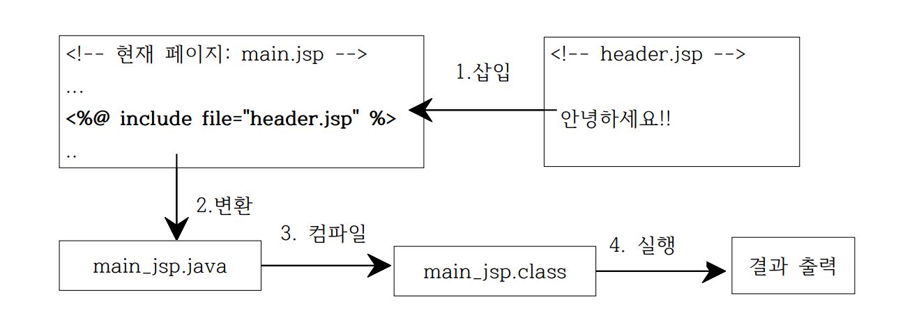
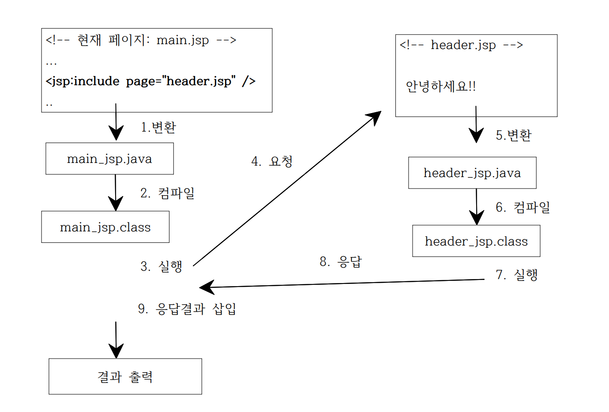

# JSP 기본요소

## 내용
### Ⅰ. JSP 기본 요소
### &nbsp;&nbsp;&nbsp;&nbsp;&nbsp;ⅰ. [JSP 스크립팅 요소](#tag)
#### &nbsp;&nbsp;&nbsp;&nbsp;&nbsp;&nbsp;&nbsp;&nbsp;&nbsp;&nbsp;&nbsp;&nbsp;&nbsp;&nbsp;&nbsp;[a. JSP표준 액션태그 요소](#actionTag)
#### &nbsp;&nbsp;&nbsp;&nbsp;&nbsp;ⅱ. [JSP 내장객체 (내장변수)](#inner)

<br><br>

<h2 id="tag"> Ⅰ. JSP 스크립팅 요소</h1>

### 1. directive 태그
1. ### page 지시어
   jsp페이지에서 설정 가능한 속성을 지시
    ```jsp
    <%@ page /*속성 = "값"*/ %>
    ```
    속성
     - contentType: 한글처리
     - import: 라이브러리 / 클래스 삽입
     - info: 현재페이지 정보 
<br><br><br>

2. ### include 지시어
   화면 재사용(다른 html/jsp 페이지를 삽입할 수 있다.)
    - #### 정적(static) 방법
        ```jsp
        <% include file="포함할 파일명" %>
        ```
        동작 메커니즘 (main.jsp에서 header.jsp를 include할 때)
        - 소스코드 내용 전체를 포함시켜 동작함<br>
        &nbsp;&nbsp;&nbsp;&nbsp;-> 포함하고 있는 .jsp페이지(main)만 서블릿으로 변환된다.
            
        
        <br>

    - <h4 id="actionTag"> 동적(dynamic) 방법<b>(a. include 액션 태그 사용)</b></h4>
  
        ```jsp
        <jsp:include page="포함할 파일명" flush="true" />
        <jsp:include page="포함할 파일명"></jsp:include>
        ```
        동작 메커니즘 (main.jsp에서 header.jsp를 include할 때)
        - main.jsp가 header.jsp로 요청한다. <br>
        요청을 받은 header.jsp가 실행된 결과가 main.jsp의 소스코드 내용으로 포함되어 동작한다.<br>
        &nbsp;&nbsp;&nbsp;&nbsp;-> 즉, 포함하고 있는 패이지와 포함 된 페이지 모두 서블릿으로 변한다.
        - flush: 버퍼의 동작방식 지정<br>-> **true**: 버퍼가 모두 채워지지 않더라도 응답처리됨, 기본으로 사용한다.)
            
    <br><br>

3. ### taglib 지시어
    외부 라이브러리로 만든 태그를 지정할 때 사용 ([대표적으로 JSTL이 제공됨]())
    ```jsp
    <%@ taglib uri="TLD파일 URI" prefix="네임스페이스명" %>
    ```
<br>
<br>

### 2. declaration 태그 (거의 사용X)
```jsp
<%!
    /* 자바 선언문 */
    // 서블릿의 인스턴스 변수 선언
    // 서블릿의 메소드 선언
%>
```
<br>

### 3 **_scriptlet 태그_** (주로 사용)
```jsp
<%
    /* 자바 코드 */
    // 서블릿의 서비스 메소드(doGet/doPost) 영역
    // 세미콜론 지정X
%>
```
<br>

### 4. expression 태그
```jsp
<%= /*브라우저에 출력할 변수(자바 표현식)*/ %>
```

<br>

### 4. comment 태그
```jsp
<%-- JSP 주석 태그 --%>
<%
    // 자바 주석 코드도 사용 가능
    /*
        자바 주석 코드도 사용 가능
    */
%>
```

<br><br>

<h2 id="inner"> b. 내장객체(내장변수)</h1>
jsp에서 선언없이 사용 가능한 변수 (내부적으로 자동으로 선언됨)

- request: HttpServletRequest
- response: HttpServletResponse
- session: HttpSession
- application: ServletContext
- config: ServletConfig
- out: JspWriter
- exception: Throwable
  
※ 서블릿에서는 아래와 같이 doGet() 또는 doPost() 메소드의 HttpServletRequest request파라미터를 이용하거나 session등을 사용하기 위해서 API를 import해줌.
```java
    String userid = request.getParameter("userid");
```


<br><br>
