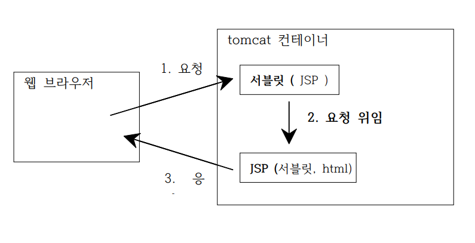
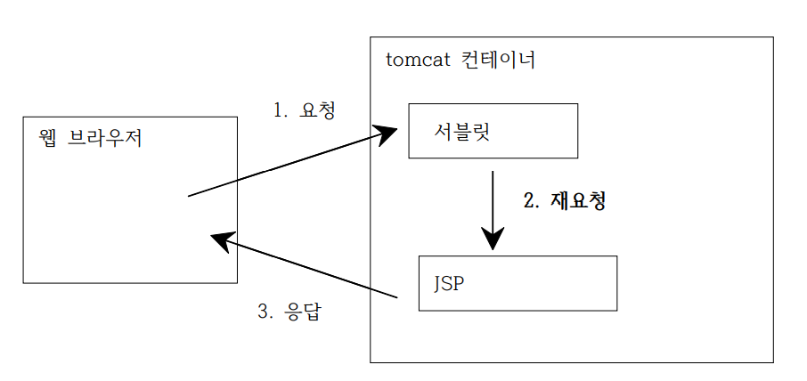
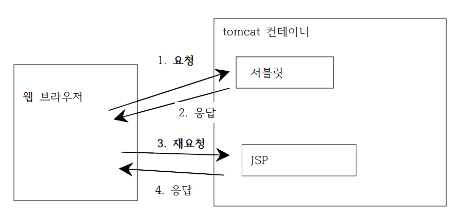

## 내용
### 요청 위임
### 1. [](#)
### 2. [](#)

<br><br>

# 요청 위임

## Ⅰ. 위임을 하는 이유

    서블릿: 자바코드(비즈니스 로직) 최적화, 뷰 처리↓<br>
    jsp: 뷰 처리 최적화, 자바 코드↓<br>
**=> 따라서 서블릿을 이용하여 브라우저의 요청을 받고 jsp는 서블릿이 실행한 결과를 보여주는 용도로만 사용한다.**
<br><br>
동작 과정
    

<br><br>

## Ⅱ. 위임 방법 (2가지)

### 1. 포워드(forward)
- HttpServletRequest이용
    ```java
    request.getRequestDispatcher("타겟.jsp").forward(request, response);
    ```
- 동작 과정(아키택쳐)
   <br><br>
    > <br>위의 과정에서 1번 요청과 번 요청이 **동일한** HttpServletRequest이다.<br><br>
        WHY?<br>
        forward()메소드의 파라미터를 통해 request와 response가 넘어가기 때문<br>
        **==> 서블릿에서 request에 저장된 data를 jsp에서 사용 가능하다.**<br>
        **==> URL이 변경되지 않는다.**<br><br>

<br>

### 2. 리다이렉트(redirect)
- HttpServletResponse 이용
  ```java
    response.sendRedirect("타겟.jsp");
  ```
- 동작 과정(아키텍쳐)
    <br><br>
    ><br>위의 과정에서 1번 요청과 3번 요청이 **다른** HttpServletResponse이다.<br>
    **==> 서블릿에서 request에 저장된 data를 jsp에서 인식(사용)할 수 없다.**<br><br>
    ex) 서블릿: request.setAttribute("k","v");<br>&nbsp;&nbsp;&nbsp;&nbsp;&nbsp;&nbsp;
        jsp: request.getAttribute("k"); -> 불가능<br><br>
- 용도: 게시판 삭제 & 수정기능<br>&nbsp;&nbsp;&nbsp;&nbsp;&nbsp;&nbsp;&nbsp;&nbsp;
            -> 게시판 삭제 요청 시 삭제 진행 후 목록으로 이동 필요한데 <br>&nbsp;&nbsp;&nbsp;&nbsp;&nbsp;&nbsp;&nbsp;&nbsp;&nbsp;&nbsp;&nbsp;&nbsp;&nbsp;&nbsp;이 경우 forward를 사용할 경우 url이 delete로 변경되어 새로 고침할 경우 다시 delete가 실행된다.